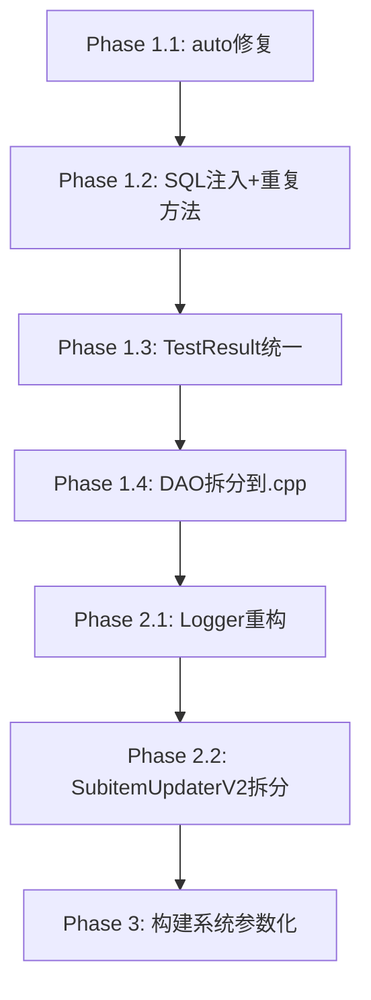

# 重构方案 Phase 1 — 代码质量提升

## 概述

基于对代码库的全面分析（21 个源文件、19 个头文件、7 个测试文件），发现以下关键问题：
- **195 处 `auto` 违规**（项目公约禁止 `auto` 类型推导）
- **多处 SQL 注入风险**（字符串拼接构造 SQL）
- **重复代码**（`TestResult` 结构体在两处定义、`writeCallback` 重复）
- **头文件内联实现**（DAO 逻辑全部在 `.h` 中）
- **原始指针所有权**（4 处非-wxWidgets 的 `new` 无 RAII 封装）
- **大类型耦合**（`SubitemUpdaterV2` 30+ 方法、`Profileitem` 35 字段）
- **全局静态 Logger 状态**（可测试性差）
- **硬编码构建路径**（CMakeLists.txt 内嵌绝对路径）

本方案分为 **3 个 Phase**，Phase 1 聚焦低风险高收益的代码质量提升。

---

## Phase 1 范围 — 实际状态审计 (2026-06-12)

> 经全量代码审查，以下为各任务的真实完成状态。

| 优先级 | 模块 | 问题 | 工作量 | 实际状态 |
|--------|------|------|--------|---------|
| P0 | 全局 | `auto` 违规修复 | 中 | **❌ NOT_STARTED** — 13 处活跃违规 (src/SubitemDAO.cpp:65, tests/ 12处) |
| P0 | `Profileitem.h` | SQL 注入修复 | 小 | **⚠️ PARTIAL** — `getByIndexId()` 已转参数化，仍有 3 处字符串拼接 (`deleteBySubId`, `updateSubitem`, `deleteById`) |
| P0 | `CurlEasyHandle.h` | 重复 `writeCallback` 删除 | 小 | **✅ COMPLETED** — 仅存单一 `writeCallback(char*,...)` |
| P1 | `ProxyFinder.h`/`ProxyTester.h` | 重复 `TestResult` 统一 | 小 | **✅ COMPLETED** — `include/TestResult.h` 已提取统一 |
| P1 | `Profileitem.h`/`Subitem.h` | DAO 类移到 `.cpp` | 中 | **✅ COMPLETED** — `src/ProfileitemDAO.cpp` + `src/SubitemDAO.cpp` 已存在 |
| P1 | `Logger` | 全局状态重构为实例化接口 | 大 | **❌ NOT_STARTED** — 全部 static；`enableConsoleOnly()` 仍为空实现 |
| P2 | `SubitemUpdaterV2` | 拆分解耦 | 大 | **❌ NOT_STARTED** — 33 个方法，无拆分后类 |
| P2 | 构建系统 | 硬编码路径参数化 | 中 | **❌ NOT_STARTED** — 21 处硬编码路径 (boost/vcpkg/gtest) |

---

## 详细方案

### 1. `auto` 类型推导修复（P0）

**实际状态**: ❌ NOT_STARTED — 13 处活跃违规

**问题**: `AGENTS.md` 禁止 `auto` 类型推导。当前剩余 13 处违规：
- `src/SubitemDAO.cpp:65` — `auto esc = [](...)`
- `tests/test_config_reader_load.cpp:248,261,273,286,299,308,320` — 7 处 `auto result = ConfigReader::load(...)`
- `tests/test_logger.cpp:50,69,207,312` — 4 处 `auto entries = capture.entries()`
- `tests/test_logger.cpp:175` — `auto testLevel = [](...)`

不计入违规项（范围 for 的 `auto&`、字符串字面量 `"auto"`、注释）。

**方案**: 用显式类型替代所有 `auto`。模式对照表：

| 当前模式 | 替换为 |
|---------|--------|
| `auto proxies = loadFallbackProxies()` | `std::vector<FallbackProxy> proxies = loadFallbackProxies()` |
| `for (const auto& sub : subs)` | `for (const db::models::Subitem& sub : subs)` |
| `auto optSub = getSubscription(subId)` | `std::optional<db::models::Subitem> optSub = getSubscription(subId)` |
| `auto now = std::chrono::system_clock::now()` | `std::chrono::system_clock::time_point now = std::chrono::system_clock::now()` |
| `auto it = delayMap_.find(idx)` | `std::unordered_map<std::string, int>::iterator it = delayMap_.find(idx)` |
| `auto& obj = parsed.as_object()` | `boost::json::object& obj = parsed.as_object()` |
| `auto [addr, port] = parseAddressPort(...)` | 拆分为两条语句 |

**策略**: 按文件逐个修复，从依赖最少的文件开始（`tests/` → `SubitemDAO.cpp`）。

**风险**: 低。纯语法替换，不影响逻辑。

---

### 2. SQL 注入修复（P0）

**问题**: `Profileitem.h:ProfileitemDAO::getByIndexId()` 直接拼接字符串：
```cpp
std::string sql = "SELECT * FROM ProfileItem WHERE IndexId = '" + indexId + "';";
```

**方案**: 改为参数化查询（`sqlite3_bind_text`）。

**影响范围**: `include/Profileitem.h` 第 164-175 行。

**可复用模式**: 创建 `SqlHelper` 工具类统一处理参数化查询，未来所有 DAO 操作复用。

---

### 3. `CurlEasyHandle.h` 重复方法删除（P0）

**问题**: 两个完全相同的 `writeCallback` 重载（`char*` 和 `void*` 版本），`void*` 版本会隐藏 `char*` 版本。

**方案**: 保留 `void*` 版本（与 `curl_write_callback` 签名匹配），删除 `char*` 版本。

**影响范围**: 删除第 115-119 行的 `char* writeCallback` 重载。

---

### 4. 统一 `TestResult` 结构体（P1）

**问题**: `ProxyFinder.h` 和 `ProxyTester.h` 各自定义 `TestResult`，字段不同：
- `ProxyTester.h`: `success, latencyMs, errorMsg`
- `ProxyFinder.h`: `success, latencyMs, errorMsg, indexId, address, port, delay`

**方案**: 
1. 移入共享头文件（如 `include/TestResult.h`）
2. 定义单一 `struct TestResult` 包含所有字段
3. `ProxyTester::test()` 返回基础字段，`ProxyFinder` 使用完整字段

---

### 5. DAO 层移到 `.cpp` 文件（P1）

**问题**: `ProfileitemDAO`、`SubitemDAO`（Subitem.h 内）全部实现在头文件中，导致：
- 编译依赖膨胀（修改 SQL 查询触发全量重编译）
- 内联实现难以调试
- 违反接口/实现分离原则

**方案**:
1. 创建 `src/ProfileitemDAO.cpp`、`src/SubitemDAO.cpp`
2. 头文件只保留类声明
3. 将 `fromStmt()`、`getAll()`、`getByIndexId()` 等方法移到 `.cpp`

**影响范围**:
- `include/Profileitem.h` → 减少约 250 行
- `include/Subitem.h` → 减少约 150 行
- 新增 `src/ProfileitemDAO.cpp`、`src/SubitemDAO.cpp`
- `CMakeLists.txt` 添加这两个源文件

---

### 6. Logger 全局状态重构（P1）

**问题**: Logger 全部使用静态方法和全局静态变量（`logDir_`, `prefix_`, `outFile_` 等），导致：
- 单元测试中状态泄漏（跨测试共享）
- 依赖 `std::chrono` 和 `std::filesystem`，测试需要 mock
- `enableConsoleOnly()` 是空实现

**方案**（分步）:
1. 将静态变量移到非静态成员
2. Logger 改为可实例化的类，同时保留兼容包装器
3. 现有 `Logger::write(...)` 内部委托给全局单例实例
4. 测试通过替换实例实现隔离

**最小改动方案**（建议 Phase 1 采用）:
- 在 `Logger` 旁新增 `LoggerInstance` 类（非静态）
- `Logger` 静态方法委托给内部 `LoggerInstance`
- 新代码逐步迁移到 `LoggerInstance`
- 修复 `enableConsoleOnly()` 死代码或标记 `[[deprecated]]`

---

### 7. 构建系统参数化（P2）

**问题**: CMakeLists.txt 硬编码了：
- `D:/boost_1_88_0/`
- `E:/vcpkg/installed/x64-mingw-static/`
- `E:/vcpkg/installed/x64-mingw-dynamic/`
- `E:/eclipse_workspace/googletest`

**方案**: 
```cmake
# 使用 CMake 变量
set(BOOST_ROOT "D:/boost_1_88_0" CACHE PATH "Boost installation root")
set(VCPKG_ROOT "E:/vcpkg" CACHE PATH "vcpkg root")
set(GTEST_ROOT "E:/eclipse_workspace/googletest" CACHE PATH "Google Test root")
```
使不同开发环境可以覆盖路径而不修改 CMakeLists.txt。

---

### 8. `SubitemUpdaterV2` 拆分（P2）

**问题**: 该类 30+ 方法，职责包含：
- 订阅更新（网络请求、解析）
- 代理查找
- Xray 生命周期管理
- 去重
- 数据库同步
- Base64/URL 编解码

**方案**: 按职责拆分为：
| 新类 | 职责 | 从 SubitemUpdaterV2 迁移的方法 |
|------|------|-------------------------------|
| `SubscriptionFetcher` | 网络请求、加速器/代理获取 | `fetchUrl`, `fetchUrlViaProxy`, `fetchUrlViaAccelerator` |
| `SubscriptionParser` | Base64 解码、配置解析 | `parseSubscription`, `decodeBase64`, `urlDecode` |
| `ProxySync` | 数据库同步 | `syncDatabases`, `migrateSubscription`, `migrateProxy`, `migrateProfileExItem` |
| `Deduplicator` | 去重逻辑 | `deduplicate`, `deduplicatePhase0/1`, `deduplicateMergedPhase`, `deduplicateBlacklistPhase`, `cleanupProfileExItem` |

---

## 不与当前代码风格冲突的原则

本方案严格遵循项目现有约定：
- **C++17 标准** — 所有变更使用 `std::optional`、`std::variant` 等 C++17 特性
- **不使用 `auto`** — 方案 1 明确修复此问题
- **异常安全** — 保持现有 `throw` 模式一致性
- **Windows 兼容** — 所有新代码考虑 MinGW/GCC 兼容性
- **SQLite 事务** — DAO 拆分后保持事务完整性
- **命名风格** — 保持项目现有 snake_case/camelCase 混合风格（不引入新约定）

---

## 依赖顺序



---

## 估算工作量

| 任务 | 文件变更数 | 预估工时 |
|------|-----------|---------|
| `auto` 修复 | 21 .cpp + 测试 | 2-3 小时 |
| SQL 注入修复 | 1 头文件 | 0.5 小时 |
| 重复 writeCallback | 1 头文件 | 0.1 小时 |
| TestResult 统一 | 2 头文件 + 2 .cpp | 0.5 小时 |
| DAO 拆分 | 4 头文件 + 2 新 .cpp + CMake | 1.5 小时 |
| Logger 重构 | 1 头文件 + 1 .cpp | 2 小时 |
| 构建参数化 | 1 CMakeLists.txt | 1 小时 |
| SubitemUpdaterV2 拆分 | 2 头文件 + 1 .cpp + 新文件 | 4 小时 |

---

## 验收标准

1. 编译无 warning（`-Wall -Wextra -pedantic`）
2. 全部 7 个测试通过（`ctest -V`）
3. `auto` 关键字 0 处违规（类型推导语境下）
4. SQL 查询全部使用参数化绑定
5. 无重复 `TestResult`/`writeCallback`
6. DAO 实现在 `.cpp` 文件中
7. 功能回归测试通过（CLI 命令 + GUI 基本操作）
