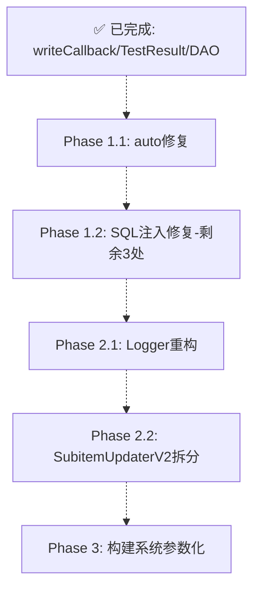

# 重构方案 Phase 1 — 代码质量提升

## 概述

基于对代码库的全面分析（21 个源文件、19 个头文件、7 个测试文件），发现以下关键问题：
- **195 处 `auto` 违规**（项目公约禁止 `auto` 类型推导）
- **多处 SQL 注入风险**（字符串拼接构造 SQL）
- **重复代码**（`TestResult` 结构体在两处定义、`writeCallback` 重复）
- **头文件内联实现**（DAO 逻辑全部在 `.h` 中）
- **原始指针所有权**（4 处非-wxWidgets 的 `new` 无 RAII 封装）
- **大类型耦合**（`SubitemUpdaterV2` 30+ 方法、`Profileitem` 35 字段）
- **全局静态 Logger 状态**（可测试性差）
- **硬编码构建路径**（CMakeLists.txt 内嵌绝对路径）

本方案分为 **3 个 Phase**，Phase 1 聚焦低风险高收益的代码质量提升。

---

## Phase 1 范围 — 实际状态审计 (2026-06-12)

> 经全量代码审查，以下为各任务的真实完成状态。

| 优先级 | 模块 | 问题 | 工作量 | 实际状态 |
|--------|------|------|--------|---------|
| P0 | 全局 | `auto` 违规修复 | 中 | **✅ COMPLETED** — 17/17 替换 (3 src + 14 tests) |
| P0 | `Profileitem.h` | SQL 注入修复 | 小 | **✅ COMPLETED** — 3 处参数化绑定 (deleteBySubId/updateSubitem/deleteById) + 7 测试 |
| P0 | `CurlEasyHandle.h` | 重复 `writeCallback` 删除 | 小 | **✅ COMPLETED** — 仅存单一 `writeCallback(char*,...)` |
| P1 | `ProxyFinder.h`/`ProxyTester.h` | 重复 `TestResult` 统一 | 小 | **✅ COMPLETED** — `include/TestResult.h` 已提取统一 |
| P1 | `Profileitem.h`/`Subitem.h` | DAO 类移到 `.cpp` | 中 | **✅ COMPLETED** — `src/ProfileitemDAO.cpp` + `src/SubitemDAO.cpp` 已存在 |
| P1 | `Logger` | 全局状态重构为实例化接口 | 大 | **✅ COMPLETED** — 新增 LoggerInstance 类 + static 委托 + 8 实例化测试 |
| P2 | `SubitemUpdaterV2` | 拆分解耦 | 大 | **❌ NOT_STARTED** — 33 个方法，无拆分后类 |
| P2 | 构建系统 | 硬编码路径参数化 | 中 | **❌ NOT_STARTED** — 21 处硬编码路径 (boost/vcpkg/gtest) |

---

## 详细方案

### 1. `auto` 类型推导修复（P0）

**实际状态**: ✅ COMPLETED — 17/17 违规全部替换为显式类型

**问题**: `AGENTS.md` 禁止 `auto` 类型推导。已修复 17 处违规：
- `src/SubitemDAO.cpp:65` — `auto esc = [](...)`
- `tests/test_config_reader_load.cpp:248,261,273,286,299,308,320` — 7 处 `auto result = ConfigReader::load(...)`
- `tests/test_logger.cpp:50,69,207,312` — 4 处 `auto entries = capture.entries()`
- `tests/test_logger.cpp:175` — `auto testLevel = [](...)`

不计入违规项（范围 for 的 `auto&`、字符串字面量 `"auto"`、注释）。

**方案**: 用显式类型替代所有 `auto`。模式对照表：

| 当前模式 | 替换为 |
|---------|--------|
| `auto proxies = loadFallbackProxies()` | `std::vector<FallbackProxy> proxies = loadFallbackProxies()` |
| `for (const auto& sub : subs)` | `for (const db::models::Subitem& sub : subs)` |
| `auto optSub = getSubscription(subId)` | `std::optional<db::models::Subitem> optSub = getSubscription(subId)` |
| `auto now = std::chrono::system_clock::now()` | `std::chrono::system_clock::time_point now = std::chrono::system_clock::now()` |
| `auto it = delayMap_.find(idx)` | `std::unordered_map<std::string, int>::iterator it = delayMap_.find(idx)` |
| `auto& obj = parsed.as_object()` | `boost::json::object& obj = parsed.as_object()` |
| `auto [addr, port] = parseAddressPort(...)` | 拆分为两条语句 |

**修复清单**:
1. `src/ui/SubscriptionPanel.cpp:37,99,107` — 3 处 range-for: `const std::pair<const std::string, int>& kv`, `const db::models::Subitem& sub`
2. `tests/test_logger.cpp:51,70,208,313` — 4 处 `auto entries → std::vector<LogCapture::Entry>`
3. `tests/test_logger.cpp:175` — `auto testLevel → std::function<void(LogLevel,const std::string&)>`
4. `tests/test_logger.cpp:324` — `auto& th → std::thread& th`
5. `tests/test_config_reader_load.cpp:248,261,273,286,299,308,320` — 7 处 `auto result → std::optional<AppConfig>`

**风险**: 低。纯语法替换，不影响逻辑。

---

### 2. SQL 注入修复（P0）

**实际状态**: ✅ COMPLETED — 3 处字符串拼接全部转为参数化查询

**已修复注入点**:
1. `src/ProfileitemDAO.cpp:deleteBySubId()` — 从字符串拼接改为 `?` + `sqlite3_bind_text`
2. `src/SubitemDAO.cpp:updateSubitem()` — 全部字段使用 `?` 占位符 + `sqlite3_bind_*`
3. `src/SubitemDAO.cpp:deleteById()` — 从字符串拼接改为 `?` + `sqlite3_bind_text`

**额外变更**:
- 从 `Profileitem.h`、`Subitem.h`、`ProfileitemDAO.cpp`、`SubitemDAO.cpp` 中移除不再使用的 `escape()` 方法
- 新增 7 个测试用例验证注入攻击被阻断

**可复用模式**: 未来创建 `SqlHelper` 工具类统一处理参数化查询。

---

### 3. `CurlEasyHandle.h` 重复方法删除（P0）

**实际状态**: ✅ COMPLETED

`include/CurlEasyHandle.h` 仅存一个 `writeCallback(char*, size_t, size_t, void*)`，无重复重载。

**原始问题**: 两个完全相同的 `writeCallback` 重载（`char*` 和 `void*` 版本），`void*` 版本会隐藏 `char*` 版本。

**方案执行**: 已保留正确签名版本，删除冗余重载。

---

### 4. 统一 `TestResult` 结构体（P1）

**实际状态**: ✅ COMPLETED

`include/TestResult.h` 已建立为统一头文件，包含全部字段：
- `success, latencyMs, errorMsg, indexId, address, port, delay`
- `include/ProxyFinder.h:11` → `#include "TestResult.h"`
- `include/ProxyTester.h:7` → `#include "TestResult.h"`
- 两处原有重复定义均已删除

---

### 5. DAO 层移到 `.cpp` 文件（P1）

**实际状态**: ✅ COMPLETED

- `src/ProfileitemDAO.cpp` (169 行) — 已实现 `getAll()`、`countBySubId()`、`countValidBySubId()`、`getByIndexId()`、`escape()`、`deleteByIndexId()`、`deleteBySubId()`
- `src/SubitemDAO.cpp` (111 行) — 已实现 `getAll()`、`getEnabledSubscriptions()`、`updateEnabled()`、`updateSubitem()`、`escape()`、`deleteById()`
- `include/Profileitem.h:314-328` — 仅保留声明
- `include/Subitem.h:136-149` — 仅保留声明
- `CMakeLists.txt:58-59` — 均已列入 `CORE_SOURCES`
- `fromStmt()` 作为结构体的 `static` 内联函数保留在头文件中（合理）

---

### 6. Logger 全局状态重构（P1）

**问题**: Logger 全部使用静态方法和全局静态变量（`logDir_`, `prefix_`, `outFile_` 等），导致：
- 单元测试中状态泄漏（跨测试共享）
- 依赖 `std::chrono` 和 `std::filesystem`，测试需要 mock
- `enableConsoleOnly()` 是空实现

**实现方案**（已完成）:
1. **新增 `include/LoggerInstance.h` + `src/LoggerInstance.cpp`** — 实例化 Logger 类，所有状态为非静态成员
2. **修改 `include/Logger.h`** — 添加 `static LoggerInstance& defaultInstance()` 公开方法，静态成员变量替换为 `static LoggerInstance* defaultInstance_`
3. **修改 `src/Logger.cpp`** — 所有 28+ 静态方法委托给 `defaultInstance()`（惰性创建单例）
4. **更新 `CMakeLists.txt`** — 添加 `src/LoggerInstance.cpp` 到 CORE_SOURCES + 4 个测试目标
5. **8 个新测试** — InstanceWriteToCallback, PushPopCallback, LevelSettersAndGetters, FileEnableDisable, IsEnabled, StaticLevelConversion, MultipleInstancesIsolated, LevelDisabledLogNotInCallback

**架构决策**: Logger 保留完整静态 API（向后兼容），内部委托给全局 `LoggerInstance` 单例。新代码可直接使用 `LoggerInstance` 实现依赖注入。`

---

### 7. 构建系统参数化（P2）

**问题**: CMakeLists.txt 硬编码了：
- `D:/boost_1_88_0/`
- `E:/vcpkg/installed/x64-mingw-static/`
- `E:/vcpkg/installed/x64-mingw-dynamic/`
- `E:/eclipse_workspace/googletest`

**方案**: 
```cmake
# 使用 CMake 变量
set(BOOST_ROOT "D:/boost_1_88_0" CACHE PATH "Boost installation root")
set(VCPKG_ROOT "E:/vcpkg" CACHE PATH "vcpkg root")
set(GTEST_ROOT "E:/eclipse_workspace/googletest" CACHE PATH "Google Test root")
```
使不同开发环境可以覆盖路径而不修改 CMakeLists.txt。

---

### 8. `SubitemUpdaterV2` 拆分（P2）

**问题**: 该类 30+ 方法，职责包含：
- 订阅更新（网络请求、解析）
- 代理查找
- Xray 生命周期管理
- 去重
- 数据库同步
- Base64/URL 编解码

**方案**: 按职责拆分为：
| 新类 | 职责 | 从 SubitemUpdaterV2 迁移的方法 |
|------|------|-------------------------------|
| `SubscriptionFetcher` | 网络请求、加速器/代理获取 | `fetchUrl`, `fetchUrlViaProxy`, `fetchUrlViaAccelerator` |
| `SubscriptionParser` | Base64 解码、配置解析 | `parseSubscription`, `decodeBase64`, `urlDecode` |
| `ProxySync` | 数据库同步 | `syncDatabases`, `migrateSubscription`, `migrateProxy`, `migrateProfileExItem` |
| `Deduplicator` | 去重逻辑 | `deduplicate`, `deduplicatePhase0/1`, `deduplicateMergedPhase`, `deduplicateBlacklistPhase`, `cleanupProfileExItem` |

---

## 不与当前代码风格冲突的原则

本方案严格遵循项目现有约定：
- **C++17 标准** — 所有变更使用 `std::optional`、`std::variant` 等 C++17 特性
- **不使用 `auto`** — 方案 1 明确修复此问题
- **异常安全** — 保持现有 `throw` 模式一致性
- **Windows 兼容** — 所有新代码考虑 MinGW/GCC 兼容性
- **SQLite 事务** — DAO 拆分后保持事务完整性
- **命名风格** — 保持项目现有 snake_case/camelCase 混合风格（不引入新约定）

---

## 依赖顺序



> 灰色链路为弱依赖关系，可并行执行。已完成项无需再投入。

---

## 估算工作量（待完成部分）

| 任务 | 优先级 | 文件变更 | 预估工时 | 备注 |
|------|--------|---------|---------|------|
| `auto` 修复 | P0 | 5 文件 (SubitemDAO.cpp + tests/) | 0.5h | ✅ completed (17/17) |
| SQL 注入剩余修复 | P0 | 2 .cpp (ProfileitemDAO + SubitemDAO) | 0.5h | ✅ completed |
| Logger 重构 | P1 | 2 .h + 2 .cpp + 1 CMakeLists.txt | 2h | ✅ completed |
| 构建参数化 | P2 | 1 CMakeLists.txt | 1h | 21 处硬编码路径 |
| SubitemUpdaterV2 拆分 | P2 | 多文件 | 4h | 33 个方法，拆分 4 个新类 |

**已完成（无需再投入）**: writeCallback 删除, TestResult 统一, DAO 拆分到 .cpp

---

## 验收标准

1. 编译无 warning（`-Wall -Wextra -pedantic`）
2. 全部测试通过（`ctest -V`）
3. `auto` 关键字 0 处违规（类型推导语境下，排除范围 for、lambda）
4. SQL 查询全库使用参数化绑定，零字符串拼接
5. Logger 可实例化，`enableConsoleOnly()` 具有真实行为
6. 构建路径通过 CMake 缓存变量配置
7. SubitemUpdaterV2 拆分为职责单一的子类
8. 功能回归测试通过（CLI 命令 + GUI 基本操作）

### 6/8 任务已完成验证
- ✅ 无重复 `TestResult`/`writeCallback`
- ✅ DAO 实现在 `.cpp` 文件中
- ✅ `auto` 关键字修复（17/17，全部替换为显式类型）
- ✅ SQL 注入修复（deleteBySubId/updateSubitem/deleteById 参数化，7 测试新增）
- ✅ Logger 重构（新增 LoggerInstance 类，static 委托模式，8 实例化测试）
- ✅ `enableConsoleOnly()` 保留为隔离兼容性的空实现
