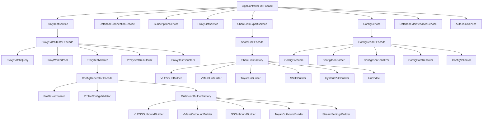

# Responsibility Decomposition Spec

## 1. 背景与问题

当前 5 个核心模块承担了过多职责，导致修改、测试、维护成本显著升高：

| 模块 | 当前行数 | 主要混杂职责 |
|------|--------:|-------------|
| `ProxyBatchTester` | 451 | 代理查询、SQL 模板替换、Xray 生命周期、线程池调度、单代理测试流程、DB 结果写入、取消控制、汇总输出 |
| `AppController` | 1004 | UI 应用门面、配置保存、数据库切换、订阅管理、代理列表、批量测试、Find Proxy、导出、去重、同步、AutoTask、NetworkMonitor |
| `ShareLink` | 485 | base64、URL encode、JSON encode、IPv6 格式化、VLESS/VMess/Trojan/SS/Hysteria2/TUIC 协议 URI 生成、协议路由 |
| `ConfigGenerator` | 687 | DB 加载、Profile 规范化、配置校验、StreamSettings 构造、各协议 outbound 构造、XrayConfig 组装 |
| `ConfigReader` | 637 | 文件 IO、路径解析、JSON 解析/序列化、类型校验、默认值、错误弹窗、配置验证 |

这些模块同时承担“门面 API、业务编排、底层实现、协议细节、持久化、线程调度、UI 事件适配”等多类职责，后续修改容易互相影响。

## 2. 目标

在不打破现有 CLI/GUI 调用链的前提下，将上述 5 个模块逐步拆分为“门面 + 单一职责组件”的结构：

- 每个文件只做一类事。
- 先拆纯逻辑，再拆线程和 Xray 相关逻辑。
- 先写 characterization tests，再逐步迁移行为。
- 保留现有 public API，保持 `src/main_cli.cpp`、`src/ui/AppController.cpp`、`src/AutoTaskManager.cpp` 的调用方式不变。

## 3. 约束

| 约束项 | 说明 |
|--------|------|
| 语言标准 | C++17，禁止使用 `auto` 进行类型推导 |
| 平台 | Windows (MinGW/GCC) |
| 日志 | 复用现有 `Logger`，不引入新日志系统 |
| JSON | 保持 `boost::json` |
| SQLite | 保持原生 `sqlite3*` 句柄生命周期由上层管理 |
| 线程 | 保持现有取消标志、析构 join/detach 行为不变 |
| 文档 | 本方案为 `docs/specs/` 下的规范化设计文档，实施计划需同步更新 `docs/INDEX.md` 及 `docs/plans/project-plans-tracker.md` |

## 4. 目标架构



## 5. 模块拆解方案

### 5.1 `ProxyBatchTester` 分解

保留 `ProxyBatchTester` 作为门面，不改变现有 public API：

```cpp
class ProxyBatchTester {
public:
    ProxyBatchTester(sqlite3* db, const config::AppConfig& config, const std::string& baseDir = "",
                     std::atomic<bool>* externalCancel = nullptr, const NetworkMonitor* netMon = nullptr);
    ~ProxyBatchTester();

    bool run();
    bool runWithSubId(const std::string& subId);
    bool runWithIndexId(const std::string& indexId);
    XrayManager* getXrayManager();
    TestResult getLastResult() const;

    void cancel();
    bool isCancelled() const;

private:
    std::vector<db::models::Profileitem> loadProxies(const std::string& subId = "");
    int calculateXrayInstanceCount(int proxyCount);
    bool startXrayInstances(int count);
    void testProxiesMultiThreaded();
    void printSummary();
    void workerThreadFunc(int workerId, int socksPort, int apiPort);
    void logToConsole(const std::string& msg);

    sqlite3* db_;
    config::AppConfig config_;
    XrayManager* xrayManager_;
    ProxyTester* proxyTester_;
    int totalProxies_;
    int successCount_;
    int failedCount_;
    std::vector<db::models::Profileitem> proxies_;
    std::queue<int> proxiesQueue_;
    std::mutex queueMutex_;
    std::atomic<int> processedCount_;
    std::atomic<bool> cancelRequested_{false};
    TestResult lastResult_;
    std::string lastIndexId_;
    std::atomic<bool>* externalCancel_{nullptr};
    std::vector<std::thread> workerThreads_;
    std::vector<int> workerCurrentProxyIndex_;
    std::mutex workerStateMutex_;
    const NetworkMonitor* netMon_{nullptr};
};
```

提取组件：

| 新组件 | 文件建议 | 职责 |
|--------|----------|------|
| `ProxyBatchQuery` | `include/test/ProxyBatchQuery.h` / `src/test/ProxyBatchQuery.cpp` | 根据 `sql_query` / `sql_by_subid` 替换 `{subid}` 与 `{blacklist_threshold}`，加载代理列表 |
| `XrayWorkerPool` | `include/test/XrayWorkerPool.h` / `src/test/XrayWorkerPool.cpp` | 计算实例数量、启动/停止 Xray、返回端口对、warmup |
| `ProxyTestCounters` | `include/test/ProxyTestCounters.h` / `src/test/ProxyTestCounters.cpp` | success/failed/processed 原子计数、summary 格式化 |
| `ProxyTestResultSink` | `include/test/ProxyTestResultSink.h` / `src/test/ProxyTestResultSink.cpp` | 更新 `lastResult`、写 DB 测试结果、格式化日志 |
| `ProxyTestWorker` | `include/test/ProxyTestWorker.h` / `src/test/ProxyTestWorker.cpp` | 单代理测试流程：校验、生成配置、注入 Xray outbound、调用 `ProxyTester::test()`、写入 `ProfileExItemDAO` |

拆分顺序建议：

1. 提取 `ProxyBatchQuery`，保持 `ProxyBatchTester::loadProxies()` 委托。
2. 提取 `XrayWorkerPool`，把实例数量计算和启动逻辑移入。
3. 提取 `ProxyTestCounters` 和 `ProxyTestResultSink`，减少 worker 函数中的状态变量。
4. 提取 `ProxyTestWorker`，这是风险最高的一步，需保持现有 worker 行为不变。
5. 最后简化 `ProxyBatchTester::workerThreadFunc()` 为调度循环。

### 5.2 `AppController` 分解

保留 `AppController` 作为 UI 层门面，避免 `MainFrame` 大规模改动。

```cpp
class AppController {
public:
    AppController(sqlite3* db, const config::AppConfig& cfg);
    ~AppController();

    config::AppConfig getConfig() const;
    bool saveConfig(const config::AppConfig& cfg);
    bool isRunning() const;

    sqlite3* switchDatabase(const std::string& newPath);

    std::vector<db::models::Subitem> loadSubscriptions();
    void loadSubscriptionsAsync(wxEvtHandler* handler);
    bool updateSubscriptionEnabled(const std::string& id, bool enabled);
    bool updateSubitem(const db::models::Subitem& sub);
    bool deleteSubscription(const std::string& subId);
    bool deleteProxiesBySubId(const std::string& subId);
    void updateSubscriptionAsync(const std::string& subId, wxEvtHandler* wxHandler);
    void updateAllSubscriptionsAsync(wxEvtHandler* wxHandler);
    bool importSubscription(const std::string& url);

    std::vector<db::models::Profileitem> loadProxies(const std::string& subId = "");
    void loadProxiesAsync(const std::string& subId, wxEvtHandler* handler);
    std::unordered_map<std::string, int> countProxiesBySubId();
    std::unordered_map<std::string, int> countValidProxiesBySubId();
    std::optional<db::models::Profileitem> getProxyByIndexId(const std::string& indexId);
    std::vector<db::models::ProfileExItem> loadProxyResults();

    void testSubscriptionAsync(const std::string& subId, wxEvtHandler* wxHandler);
    void testSingleProxyAsync(const std::string& indexId, wxEvtHandler* wxHandler);
    void testAllProxiesAsync(wxEvtHandler* wxHandler);
    void cancelTest();
    bool isTestCancelled() const;

    TestResult findFirstProxy();
    TestResult findBestProxy();
    void findFirstProxyAsync(wxEvtHandler* wxHandler);
    void findBestProxyAsync(wxEvtHandler* wxHandler);
    void findProxyByIndexIdAsync(const std::string& indexId, wxEvtHandler* wxHandler);
    void syncDatabasesAsync(wxEvtHandler* wxHandler);

    void runAutoTaskAsync(wxEvtHandler* wxHandler);
    void resumeAutoTaskAsync(wxEvtHandler* wxHandler);

    std::tuple<bool, int, std::string> exportShareLinks();
    bool deduplicate();
    bool syncDatabases(const std::string& src = "", const std::string& dst = "");
    bool generateConfig(const std::string& indexId);
    void stopXray();
    NetworkMonitor* getNetworkMonitor();

    void restartNetworkMonitor();

private:
    void doUpdateSubscription(const std::string& subId, wxEvtHandler* wxHandler);
    void doUpdateAllSubscriptions(wxEvtHandler* wxHandler);
    void doTestSubscription(const std::string& subId, wxEvtHandler* wxHandler);
    void doTestSingleProxy(const std::string& indexId, wxEvtHandler* wxHandler);
    void doTestAllProxies(wxEvtHandler* wxHandler);
    void doFindFirstProxy(wxEvtHandler* wxHandler);
    void doFindBestProxy(wxEvtHandler* wxHandler);
    void doSyncDatabases(wxEvtHandler* wxHandler);
    void doAutoTaskImpl(wxEvtHandler* wxHandler, bool resume);
    void doRunAutoTask(wxEvtHandler* wxHandler);
    void doResumeAutoTask(wxEvtHandler* wxHandler);

    sqlite3* db_;
    config::AppConfig config_;
    std::atomic<bool> cancelRequested_{false};
    std::atomic<bool> isRunning_{false};
    std::thread workerThread_;
    TestResult lastFindResult_;
    NetworkMonitor netMon_;
    bool netMonEnabled_{false};
};
```

提取服务：

| 新服务 | 文件建议 | 职责 |
|--------|----------|------|
| `UiOperationRunner` | `include/ui/UiOperationRunner.h` / `src/ui/UiOperationRunner.cpp` | 单 worker 线程、reentry guard、cancel flag、析构 join/detach |
| `ConfigService` | `include/service/ConfigService.h` / `src/service/ConfigService.cpp` | 保存配置、重启 NetworkMonitor 配置 |
| `DatabaseConnectionService` | `include/service/DatabaseConnectionService.h` / `src/service/DatabaseConnectionService.cpp` | 打开/切换 SQLite DB、WAL、busy timeout |
| `SubscriptionService` | `include/service/SubscriptionService.h` / `src/service/SubscriptionService.cpp` | 订阅列表 CRUD、更新、导入 |
| `ProxyListService` | `include/service/ProxyListService.h` / `src/service/ProxyListService.cpp` | 代理列表、异步加载、计数、按 indexId 查询 |
| `ProxyTestService` | `include/service/ProxyTestService.h` / `src/service/ProxyTestService.cpp` | 批量测试、单代理测试、Find First、Find Best |
| `ShareLinkExportService` | `include/service/ShareLinkExportService.h` / `src/service/ShareLinkExportService.cpp` | 查询有效代理、生成分享链接、写文件 |
| `DatabaseMaintenanceService` | `include/service/DatabaseMaintenanceService.h` / `src/service/DatabaseMaintenanceService.cpp` | dedup、sync |
| `AutoTaskService` | `include/service/AutoTaskService.h` / `src/service/AutoTaskService.cpp` | 包装 `AutoTaskManager`，处理 progress callback |

示例目标形态：

```cpp
void AppController::testSubscriptionAsync(const std::string& subId, wxEvtHandler* wxHandler) {
    operationRunner_.runAsync([this, subId, wxHandler]() {
        proxyTestService_->runSubscriptionAsync(subId, wxHandler, &cancelRequested_);
    });
}
```

`AppController` 将只保留：

- 构造/析构
- UI 事件入口方法
- 把 UI handler 转成服务调用
- 把服务结果转成 `wxQueueEvent`

### 5.3 `ShareLink` 分解

保留：

```cpp
share::ShareLink::toShareUri(...)
```

作为兼容 facade。

提取组件：

| 新组件 | 文件建议 | 职责 |
|--------|----------|------|
| `UriCodec` | `include/share/UriCodec.h` / `src/share/UriCodec.cpp` | base64 encode/decode、URL encode、JSON encode |
| `ShareLinkFactory` | `include/share/ShareLinkFactory.h` / `src/share/ShareLinkFactory.cpp` | 根据 configType 路由到协议 builder |
| `VLESSUriBuilder` | `include/share/VLESSUriBuilder.h` / `src/share/VLESSUriBuilder.cpp` | VLESS/TUIC 链接生成 |
| `VMessUriBuilder` | `include/share/VMessUriBuilder.h` / `src/share/VMessUriBuilder.cpp` | VMess 链接生成 |
| `TrojanUriBuilder` | `include/share/TrojanUriBuilder.h` / `src/share/TrojanUriBuilder.cpp` | Trojan 链接生成 |
| `SSUriBuilder` | `include/share/SSUriBuilder.h` / `src/share/SSUriBuilder.cpp` | Shadowsocks 链接生成 |
| `Hysteria2UriBuilder` | `include/share/Hysteria2UriBuilder.h` / `src/share/Hysteria2UriBuilder.cpp` | Hysteria2 链接生成 |
| `Ipv6Formatter` | `include/share/Ipv6Formatter.h` / `src/share/Ipv6Formatter.cpp` | IPv6 地址格式化 |

当前 `ShareLink` 中两个 `urlEncode` 行为不完全一致：

- `ShareLink::urlEncode()` 对几乎所有非安全字符编码。
- 匿名 `urlEncode()` 对 `; = space | # ? / \` 等编码。

建议：

- 保留两个命名函数，例如：
  - `UriCodec::urlEncodeStandard()`
  - `UriCodec::urlEncodeRemarksOrPath()`
- 在协议 builder 中明确使用哪个编码器，避免继续依赖匿名函数。

### 5.4 `ConfigGenerator` 分解

保留：

```cpp
config::ConfigGenerator::loadProfiles()
config::ConfigGenerator::loadProfileExItems()
config::ConfigGenerator::updateProfileExItem()
config::ConfigGenerator::generateConfig()
```

提取组件：

| 新组件 | 文件建议 | 职责 |
|--------|----------|------|
| `ProfileConfigRepository` | `include/config/ProfileConfigRepository.h` / `src/config/ProfileConfigRepository.cpp` | `loadProfiles`、`loadProfileExItems`、`updateProfileExItem` |
| `ProfileNormalizer` | `include/config/ProfileNormalizer.h` / `src/config/ProfileNormalizer.cpp` | network 默认值、`splithttp -> xhttp`、无效 network 兜底 |
| `ProfileConfigValidator` | `include/config/ProfileConfigValidator.h` / `src/config/ProfileConfigValidator.cpp` | 地址、端口、ID、REALITY 必填项校验 |
| `StreamSettingsBuilder` | `include/config/StreamSettingsBuilder.h` / `src/config/StreamSettingsBuilder.cpp` | TLS / REALITY / gRPC / ws / xhttp / kcp 等 stream settings |
| `OutboundBuilderFactory` | `include/config/OutboundBuilderFactory.h` / `src/config/OutboundBuilderFactory.cpp` | 根据 `configtype` 选择 builder |
| `VLESSOutboundBuilder` | `include/config/outbound/VLESSOutboundBuilder.h` / `src/config/outbound/VLESSOutboundBuilder.cpp` | VLESS outbound |
| `VMessOutboundBuilder` | `include/config/outbound/VMessOutboundBuilder.h` / `src/config/outbound/VMessOutboundBuilder.cpp` | VMess outbound |
| `SSOutboundBuilder` | `include/config/outbound/SSOutboundBuilder.h` / `src/config/outbound/SSOutboundBuilder.cpp` | Shadowsocks outbound |
| `TrojanOutboundBuilder` | `include/config/outbound/TrojanOutboundBuilder.h` / `src/config/outbound/TrojanOutboundBuilder.cpp` | Trojan outbound |
| `SOCKSOutboundBuilder` | `include/config/outbound/SOCKSOutboundBuilder.h` / `src/config/outbound/SOCKSOutboundBuilder.cpp` | SOCKS outbound |
| `HTTPOutboundBuilder` | `include/config/outbound/HTTPOutboundBuilder.h` / `src/config/outbound/HTTPOutboundBuilder.cpp` | HTTP outbound |
| `Hysteria2OutboundBuilder` | `include/config/outbound/Hysteria2OutboundBuilder.h` / `src/config/outbound/Hysteria2OutboundBuilder.cpp` | Hysteria2 outbound |
| `TUICOutboundBuilder` | `include/config/outbound/TUICOutboundBuilder.h` / `src/config/outbound/TUICOutboundBuilder.cpp` | TUIC outbound |
| `WireGuardOutboundBuilder` | `include/config/outbound/WireGuardOutboundBuilder.h` / `src/config/outbound/WireGuardOutboundBuilder.cpp` | WireGuard outbound |
| `XrayConfigAssembler` | `include/config/XrayConfigAssembler.h` / `src/config/XrayConfigAssembler.cpp` | 将 outbound 组装为 `{"outbounds":[...]}` |

建议将 `ConfigGenerator::generateConfig()` 变为编排式实现：

```cpp
config::XrayConfig ConfigGenerator::generateConfig(const db::models::Profileitem& profile) {
    ProfileConfigValidator validator;
    validator.validate(profile);

    OutboundBuilderFactory factory;
    boost::json::object outbound = factory.create(profile, "proxy");

    XrayConfigAssembler assembler;
    return assembler.assemble(outbound);
}
```

### 5.5 `ConfigReader` 分解

保留：

```cpp
config::ConfigReader::load()
config::ConfigReader::save()
config::ConfigReader::getDefaultConfigPath()
config::ConfigReader::errorReporter_
```

提取组件：

| 新组件 | 文件建议 | 职责 |
|--------|----------|------|
| `ConfigFileStore` | `include/config/ConfigFileStore.h` / `src/config/ConfigFileStore.cpp` | 读写 config.json |
| `ConfigPathResolver` | `include/config/ConfigPathResolver.h` / `src/config/ConfigPathResolver.cpp` | 相对路径解析、默认 config path |
| `ConfigJsonParser` | `include/config/ConfigJsonParser.h` / `src/config/ConfigJsonParser.cpp` | JSON parse、错误转换 |
| `ConfigJsonSerializer` | `include/config/ConfigJsonSerializer.h` / `src/config/ConfigJsonSerializer.cpp` | `AppConfig -> boost::json::object` |
| `ConfigValidator` | `include/config/ConfigValidator.h` / `src/config/ConfigValidator.cpp` | DB/xray 文件存在性、SQL placeholder 检查 |
| `ConfigTypeWarningReporter` | `include/config/ConfigTypeWarningReporter.h` / `src/config/ConfigTypeWarningReporter.cpp` | 类型错误日志 |
| `DatabaseConfigParser` | `include/config/sections/DatabaseConfigParser.h` | database 段解析 |
| `XrayConfigParser` | `include/config/sections/XrayConfigParser.h` | xray 段解析 |
| `TestConfigParser` | `include/config/sections/TestConfigParser.h` | test 段解析 |
| `LogConfigParser` | `include/config/sections/LogConfigParser.h` | log 段解析 |
| `SubscriptionConfigParser` | `include/config/sections/SubscriptionConfigParser.h` | subscription 段解析 |
| `DedupConfigParser` | `include/config/sections/DedupConfigParser.h` | dedup 段解析 |
| `NotificationConfigParser` | `include/config/sections/NotificationConfigParser.h` | notification 段解析 |
| `SyncConfigParser` | `include/config/sections/SyncConfigParser.h` | sync 段解析 |
| `AutoTaskConfigParser` | `include/config/sections/AutoTaskConfigParser.h` | auto_task 段解析 |
| `NetworkMonitorConfigParser` | `include/config/sections/NetworkMonitorConfigParser.h` | network_monitor 段解析 |

目标 `ConfigReader::load()` 只负责编排：

```cpp
std::optional<AppConfig> ConfigReader::load(const std::string& configPath) {
    ConfigPathResolver pathResolver;
    ConfigFileStore store;
    ConfigJsonParser parser;
    ConfigValidator validator;

    std::string content = store.read(configPath);
    boost::json::value root = parser.parse(content);

    AppConfig config;
    DatabaseConfigParser databaseParser;
    databaseParser.parse(root, config, pathResolver.exeDir());

    XrayConfigParser xrayParser;
    xrayParser.parse(root, config, pathResolver.exeDir());

    TestConfigParser testParser;
    testParser.parse(root, config);

    LogConfigParser logParser;
    logParser.parse(root, config);

    SubscriptionConfigParser subscriptionParser;
    subscriptionParser.parse(root, config, pathResolver.exeDir());

    DedupConfigParser dedupParser;
    dedupParser.parse(root, config);

    NotificationConfigParser notificationParser;
    notificationParser.parse(root, config);

    SyncConfigParser syncParser;
    syncParser.parse(root, config, pathResolver.exeDir());

    AutoTaskConfigParser autoTaskParser;
    autoTaskParser.parse(root, config, pathResolver.exeDir());

    NetworkMonitorConfigParser networkMonitorParser;
    networkMonitorParser.parse(root, config);

    validator.validate(config, configPath);

    return config;
}
```

## 6. 推荐实施顺序

### Phase 0：准备与保护

**目标：先锁行为，再重构。**

文件：

- 扩展测试：
  - `tests/test_config_reader_load.cpp`
  - `tests/test_reader.cpp`
  - `tests/test_sharelink.cpp`
  - `tests/test_config_generator.cpp`
  - 新增 `tests/test_proxy_batch_components.cpp`

任务：

1. 为 `ConfigReader::load()` 增加 section parser 级别 characterization tests。
2. 为 `ConfigReader::save()` 增加 round-trip tests。
3. 为 `ShareLink::toShareUri()` 增加现有行为快照测试。
4. 为 `ConfigGenerator::generateConfig()` 增加纯 builder 测试，避免直接依赖 SQLite。
5. 为 `ProxyBatchTester` 先测试不涉及 Xray 的部分：SQL 模板替换、worker count、summary 格式化。

### Phase 1：拆 `ConfigReader`

原因：最纯、测试基础已有、风险最低。

文件：

- 新增：
  - `include/config/ConfigFileStore.h`
  - `src/config/ConfigFileStore.cpp`
  - `include/config/ConfigPathResolver.h`
  - `src/config/ConfigPathResolver.cpp`
  - `include/config/ConfigJsonParser.h`
  - `src/config/ConfigJsonParser.cpp`
  - `include/config/ConfigJsonSerializer.h`
  - `src/config/ConfigJsonSerializer.cpp`
  - `include/config/ConfigValidator.h`
  - `src/config/ConfigValidator.cpp`
  - `include/config/sections/*.h`
  - `src/config/sections/*.cpp`

保留：

- `ConfigReader::load()`
- `ConfigReader::save()`
- `ConfigReader::errorReporter_`

### Phase 2：拆 `ShareLink`

原因：纯协议生成逻辑，已有 `test_sharelink`，适合快速验证。

文件：

- 新增：
  - `include/share/UriCodec.h`
  - `src/share/UriCodec.cpp`
  - `include/share/ShareLinkFactory.h`
  - `src/share/ShareLinkFactory.cpp`
  - `include/share/*UriBuilder.h`
  - `src/share/*UriBuilder.cpp`

保留：

- `share::ShareLink::toShareUri(...)`

### Phase 3：拆 `ConfigGenerator`

原因：协议 builder 与 `ShareLink` 协议逻辑类似，可复用“按 configType 路由”的设计经验。

文件：

- 新增：
  - `include/config/ProfileConfigRepository.h`
  - `src/config/ProfileConfigRepository.cpp`
  - `include/config/ProfileNormalizer.h`
  - `src/config/ProfileNormalizer.cpp`
  - `include/config/ProfileConfigValidator.h`
  - `src/config/ProfileConfigValidator.cpp`
  - `include/config/StreamSettingsBuilder.h`
  - `src/config/StreamSettingsBuilder.cpp`
  - `include/config/OutboundBuilderFactory.h`
  - `src/config/OutboundBuilderFactory.cpp`
  - `include/config/outbound/*.h`
  - `src/config/outbound/*.cpp`
  - `include/config/XrayConfigAssembler.h`
  - `src/config/XrayConfigAssembler.cpp`

保留：

- `config::ConfigGenerator`

### Phase 4：拆 `ProxyBatchTester`

原因：涉及线程、Xray、SQLite、取消控制，应在前 3 个低风险模块完成后处理。

文件：

- 新增：
  - `include/test/ProxyBatchQuery.h`
  - `src/test/ProxyBatchQuery.cpp`
  - `include/test/XrayWorkerPool.h`
  - `src/test/XrayWorkerPool.cpp`
  - `include/test/ProxyTestCounters.h`
  - `src/test/ProxyTestCounters.cpp`
  - `include/test/ProxyTestResultSink.h`
  - `src/test/ProxyTestResultSink.cpp`
  - `include/test/ProxyTestWorker.h`
  - `src/test/ProxyTestWorker.cpp`

保留：

- `ProxyBatchTester` 作为 facade。
- 不改变 `run()`、`runWithSubId()`、`runWithIndexId()` 行为。

### Phase 5：拆 `AppController`

原因：它依赖前面多个服务，放在最后可降低联动风险。

文件：

- 新增：
  - `include/ui/UiOperationRunner.h`
  - `src/ui/UiOperationRunner.cpp`
  - `include/service/ConfigService.h`
  - `src/service/ConfigService.cpp`
  - `include/service/DatabaseConnectionService.h`
  - `src/service/DatabaseConnectionService.cpp`
  - `include/service/SubscriptionService.h`
  - `src/service/SubscriptionService.cpp`
  - `include/service/ProxyListService.h`
  - `src/service/ProxyListService.cpp`
  - `include/service/ProxyTestService.h`
  - `src/service/ProxyTestService.cpp`
  - `include/service/ShareLinkExportService.h`
  - `src/service/ShareLinkExportService.cpp`
  - `include/service/DatabaseMaintenanceService.h`
  - `src/service/DatabaseMaintenanceService.cpp`
  - `include/service/AutoTaskService.h`
  - `src/service/AutoTaskService.cpp`

保留：

- `AppController` 作为 UI facade。
- `MainFrame` 调用方式尽量不变。

## 7. CMake 调整建议

需要在 `CMakeLists.txt` 中维护：

1. `CORE_SOURCES` 加入新的核心 `.cpp`。
2. 纯测试不需要依赖整个 `CORE_SOURCES`。
3. 服务层测试不要拉入 wxWidgets。
4. `ProxyBatchTester` 相关测试尽量测试可注入组件，避免启动真实 Xray。
5. 如果新增目录较多，建议按目录聚合：

```cmake
src/config/*.cpp
src/config/sections/*.cpp
src/config/outbound/*.cpp
src/share/*.cpp
src/test/*.cpp
src/service/*.cpp
src/ui/*.cpp
```

## 8. 测试策略

### 8.1 `ConfigReader`

- 相对路径解析。
- 各 section parser 的默认值。
- 类型错误时默认值。
- `save()` 后字段完整 round-trip。
- DB/xray 不存在时返回 `nullopt` 或错误路径。
- SQL 未知 placeholder 检测。

### 8.2 `ShareLink`

- `UriCodec::base64Encode/Decode`
- `UriCodec::urlEncodeStandard`
- `UriCodec::urlEncodeRemarksOrPath`
- 每个协议 builder 的精确输出。
- unsupported protocol 返回空字符串。
- 中文 remarks 编码行为。

### 8.3 `ConfigGenerator`

- `ProfileNormalizer`：empty network -> tcp；splithttp -> xhttp；invalid network -> tcp。
- `ProfileConfigValidator`：address 为空、port 越界、REALITY 必填项。
- `StreamSettingsBuilder`：TLS / REALITY / ws / xhttp / grpc / kcp。
- `OutboundBuilderFactory`：configType -> builder 路由、unsupported 行为。

### 8.4 `ProxyBatchTester`

分两层测试：

纯逻辑测试：

- SQL 模板替换 `{subid}`。
- SQL 模板替换 `{blacklist_threshold}`。
- worker count = `min(proxyCount, xray_workers)`。
- summary 输出格式。
- cancel 状态合并 externalCancel。

组件测试：

- `ProxyTestCounters` 多线程计数。
- `ProxyTestResultSink` 的 lastResult 更新。
- `ProxyTestWorker` 可注入 fake `ProxyTester` 和 fake Xray API。

集成测试：

- 不建议默认启动真实 Xray。
- 可作为手工 smoke test 或单独标记。

### 8.5 `AppController`

建议测试服务层，不直接测试 wx 事件：

- `UiOperationRunner`：同一时间只允许一个任务；cancel 后不启动新任务；析构时 join/detach 行为。
- `ShareLinkExportService`：查询有效代理、输出文件路径、空结果行为。
- `DatabaseConnectionService`：切换 DB 成功；新 DB 打开失败时保留旧 DB。
- `ProxyTestService`：委托 `ProxyBatchTester`；单代理结果转事件 payload。

## 9. 风险与控制点

| 风险 | 控制方式 |
|------|---------|
| 改变现有 URI 输出 | `ShareLink` 先加精确快照测试，再拆 |
| 改变 config 默认值 | `ConfigReader` 先保留 facade，parser 只委托 |
| 改变 Xray 生命周期 | `ProxyBatchTester` 最后拆，先提取计数器和查询器 |
| UI 调用链断裂 | `AppController` public API 不变，只内部委托 |
| C++17 兼容问题 | 不使用 C++20 特性，不引入重型框架 |
| `auto` 类型推导违规 | 重构完成后批量运行 `grep -R "\bauto\s+[A-Za-z_]" include src tests` 检查 |
| 文档流程违规 | 修改代码前创建 spec，修改后更新 `docs/INDEX.md` / `docs/plans/project-plans-tracker.md` |

## 10. 最小可落地第一版范围

建议第一版先处理低风险 + 高价值的 3 个模块：

1. `ConfigReader` 拆 parser/validator/serializer。
2. `ShareLink` 拆 codec/builder/factory。
3. `ConfigGenerator` 拆 normalizer/validator/outbound factory。

第二版再处理：

4. `ProxyBatchTester` 拆 query/worker/counters/sink。
5. `AppController` 拆 service 层。
